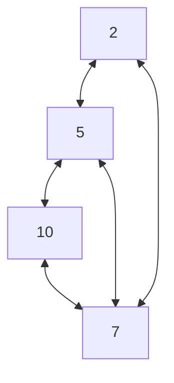

# Programming in C

### Structure

```c
#include <stdio.h>

int main(){

	// Your Code Here
	
	return 0;
}
```

- `#include <stdio.h>` -> This imports necessary utilities which allows us to take input or send output while running the code.
- `int main()` -> This is the function that runs when we run the code. Essentially this is the starter point of our file.
- `return 0` -> This is the return statement of the *main* function.

### Execution Command

```bash
gcc hello.c -o hello
./hello
```

> In IDEs, a **RUN** button is present which does all of it by itself. So there's no need of writing these commands if you have an IDE configured.

## Variables

```c
int a = 25;                           // 2 to 4 bytes; %d, %i
short int b = -25;                    // 2 bytes; %hd
long int c = -256789;                 // 4 to 8 bytes; %ld, %li
long long int d = 12345678;           // >8 bytes; %lld, %lli
unsigned int e = 45;                  // 2 to 4 bytes; non-negative; %u
unsigned long int f = 4567;           // >4 bytes; non-negative; %lu
unsigned long long int g = 456789;    // >8 bytes; non-negative; %llu


char h = 'x';                         // 1 byte; %c
char i = '9';

float j = 1.25;                       // 4 bytes; %f

double k = 12.56;                     // 8 bytes; %lf
```

> **Signed** integers can contain negative values, but **Unsigned** integers can't.

## Constants

```c
const int a = 5;    // Can not update this value later in code
```

## ASCII

**American Standard Code for Information Interchange**

This essentially stores numeric value for certain alphabets and symbols. This is for ease of computations.

> `a` starts from 97
> `A` starts from 65

## Bit-wise Operators

- `&` and `|` -> **AND** and **OR**
- `^` -> XOR
- `~` -> COMPLEMENT
- `<<` -> Shift Left
- `>>` -> Shift Right

> These operations are done in *8* bits

**AND**
```
12 = 00001100 (In Binary)
25 = 00011001 (In Binary)

Bit Operation of 12 and 25
  00001100
& 00011001
  ________
  00001000  = 8 (In decimal)
```

**OR**
```
12 = 00001100 (In Binary)
25 = 00011001 (In Binary)

Bitwise OR Operation of 12 and 25
  00001100
| 00011001
  ________
  00011101  = 29 (In decimal)
```

**XOR**
```
12 = 00001100 (In Binary)
25 = 00011001 (In Binary)

Bitwise XOR Operation of 12 and 25
  00001100
^ 00011001
  ________
  00010101  = 21 (In decimal)
```

COMPLEMENT
```
35 = 00100011 (In Binary)

Bitwise complement Operation of 35
~ 00100011 
  ________
  11011100  = 220 (In decimal)
```

**RIGHT SHIFT**
```
212 = 11010100 (In binary)

212 >> 2 = 00110101 (In binary) [Right shift by two bits]
212 >> 7 = 00000001 (In binary)
212 >> 8 = 00000000 
212 >> 0 = 11010100 (No Shift)
```

LEFT SHIFT
```
212 = 11010100 (In binary)

212 << 1 = 110101000 (In binary) [Left shift by one bit]
212 << 0 = 11010100 (Shift by 0)
212 << 4 = 110101000000 (In binary) =3392(In decimal)
```

## Preprocessors and Macros

Preprocessors or macros can transform our program before it is compiled. These transformations can be the inclusion of header files, macro expansions, etc.

They start with `#`

Example 1: Importing header files
```c
#include <stdio.h>
```

Example 2: Defining constant values
```c
#define PI 3.14
```

Example 3: Defining functions
```c
#define circleArea(r) (3.1415*(r)*(r))
```

### Conditional Directives

The **if** statement is tested during the execution time to check whether a block of code should be executed or not, whereas the **conditionals** are used to include (or skip) a block of code in your program before execution.

```c
#if expression
    // conditional codes if expression is non-zero
#elif expression1
    // conditional codes if expression is non-zero
#elif expression2
    // conditional codes if expression is non-zero
#else
    // conditional if all expressions are 0
#endif
```

### \#defined

The special operator `#defined` is used to test whether a certain macro is defined or not. It's often used with `#if` directive.

```c
#if defined BUFFER_SIZE && BUFFER_SIZE >= 2048
  // codes
```

### Predefined Macros

- `__DATE__` -> String containing current date
- `__FILE__` -> String containing current file name
- `__LINE__` -> Integer containing current line number
- `__TIME__` -> String containing current time

## sizeof() Function

Returns the size of data (constants, variables, array, structure, etc).

```c
int a;

printf("Size of int=%lu bytes\n",sizeof(a));
```

Output:
```
4
```

## goto Statement

Jumps program control to mentioned statement.

```c
int number = 19;

if (number > 18) {
	goto vote;
}

printf("Age less than 18\n");  // This will not execute

vote:
	printf("Age greater than 18\n");
```

Output:
```
Age greater than 18
```

Try to avoid `goto` statement as this leads to buggy code.

## Storage class

Every variable in C programming has two properties: type and storage class. Storage class determines the scope, visibility and lifetime of a variable.

1. Automatic or Local
	The local variables exist only inside the block in which it is declared.

```c
int main() {
	int a = 5;  // Value is accessible only in main()
}
```

2. External
	They are accessible from any function inside the program.

```c
int a = 5;  // global declaration

int main() {
	printf("%d", a);  // a is accessible here
}
```

3. Static
	The value of a static variable persists until the end of the program.

```c
static int a = 5;  // Value persists till the end of program
```

4. Register
	Register variables are supposed to be faster than local variables.

## Addresses

If you have a variable `var` in your program, `&var` will give you its address in the memory.

```c
int var = 5;
printf("var: %d\n", var);  // prints value

printf("address of var: %p", &var);  // prints address
```

Output:
```
var: 5 
address of var: 2686778
```

## C Pointers

Pointers are special variables that are used to store addresses rather than values.

All of these are syntax of declaring pointers.
```c
int* p1;
int *p2;
int * p3;
```

Storing address of a variable in a pointer:
```c
int a = 5;  // a has value 5

int *p = &a;  // p has address of a
```

Retrieving value from a pointer (use of `*`):
```c
int a = 5;
int *p = &a;

printf("%d \n", *p);  // Prints 5
```

Updating and printing:
```c
int a = 5;
int *p = &a;

printf("%d \n", *p);  // prints 5

a = 6;

printf("%d \n", *p);  // prints 6

*p = 7;

printf("%d \n", *p);  // prints 7
```

### Arrays and Pointers

```c
#include <stdio.h>
int main() {

  int i, x[6], sum = 0;

  printf("Enter 6 numbers: ");

  for(i = 0; i < 6; ++i) {
  
  // Equivalent to scanf("%d", &x[i]);
      scanf("%d", x + i);

  // Equivalent to sum += x[i]
      sum += *(x + i);
  }

  printf("Sum = %d", sum);

  return 0;
}
```

Here we are accessing array elements using pointers. `x[0]` is equal to `x` as both are the starting addresses. And we can access elements by `*(x + n)` which is similar to `x[n]`.

### Passing addresses and pointers to Functions

Passing addresses:
```c
#include <stdio.h>
void swap(int *n1, int *n2);  // function declaration

int main()
{
    int num1 = 5, num2 = 10;

    // address of num1 and num2 is passed
    swap( &num1, &num2);

    printf("num1 = %d\n", num1);
    printf("num2 = %d", num2);
    return 0;
}

void swap(int* n1, int* n2)  // function definition
{
    int temp;
    temp = *n1;
    *n1 = *n2;
    *n2 = temp;
}
```

As you can see, we return nothing from the function, as we swap the actual values in the addresses passed.

Passing pointers:
```c
#include <stdio.h>

void addOne(int* ptr) {
  (*ptr)++; // adding 1 to *ptr
}

int main()
{
  int* p, i = 10;
  p = &i;
  addOne(p);

  printf("%d", *p); // 11
  return 0;
}
```

## Dynamic Memory Allocation

Allocating memory and using it to store values at runtime. This differs from variable we have been doing as they were allocating a fixed amount of memory at compile time. But when our memory requirement varies, we need to allocate it at runtime.

- **malloc()**

Reserves a block of memory of the specified number of bytes. And, it returns a pointer of void which can be casted into pointers of any form.
```c
ptr = (float*) malloc(100 * sizeof(float));
```

- **calloc()**

Similar to `malloc()`, but it also initializes all bits to zero.
```c
ptr = (float*) calloc(25, sizeof(float));
```

- **free()**

Frees memory allocated by `malloc()` or `calloc()`.
```c
free(ptr);
```

- **realloc()**

Allows changing size of already allocated memory.
```c
ptr = (int*) calloc(5, sizeof(int));

ptr = realloc(ptr, 10 * sizeof(int));
```

## Strings

A character array represents a string.
```c
char[] name = "Aarju Pal";
```

Arrays and strings are second-class citizens in C; they do **NOT** support the assignment operator once it is declared.
```c
char c[100];
c = "C programming";  // Error! array type is not assignable.
```

Reading a string from user:
```c
#include <stdio.h>
int main()
{
    char name[20];
    printf("Enter name: ");
    scanf("%s", name);
    
    printf("Your name is %s.", name);
    return 0;
}
```

Output:
```
Enter name: Dennis Ritchie
Your name is Dennis.
```

Notice that only the first word is received and not the entire line.

Reading a string line from user:
```c
#include <stdio.h>
int main()
{
    char name[30];
    printf("Enter name: ");
    
    fgets(name, sizeof(name), stdin);  // read string
    
    printf("Name: ");
    
    puts(name);    // display string
    return 0;
}
```

Output:
```
Enter name: Tom Hanks
Name: Tom Hanks
```

- `fgets()` -> This has three parameters: address of variable, total size of input accepted, and source of input. This allows for longer input, essentially a lines.
- `puts()` -> This prints the value from *name*, just like `printf()`.

**Commonly used String functions:**
- `strlen()` -> Returns length of a string
- `strcpy()` -> Copies a string to another
- `strcmp()` -> Compares two strings
- `strcat()` -> Concatenates two strings

## Structures

A collection of variables (can be of different types) under a single name.

Creating a Structure:
```c
struct Person {
  char name[50];
  int age;
  float salary;
};
```

When a `struct` type is declared, no storage or memory is allocated. To allocate memory of a given structure type and work with it, we need to create variables.

Creating Variables:
```c
struct Person person1, person2, p[20];
```

Here we made variable `person1`, variable `person2`, and an array of size `20` of type `Person`. Each index will behave like a variable for the structure.

Accessing Structure members:
```c
puts(person1.name);

printf("%d \n", person2.age);

printf("%f \n", p[0].salary);
```

### typedef

This keyword is used to create an alias of a structure. This simplifies variable declarations for a structure.

Using typedef:
```c
typedef struct Distance {
  int feet;
  float inch;
} distances;

int main() {
  distances d1, d2;
}
```

Here `distances` is an alias name for structure `Distance`.

### Nested Structures

Using structures inside another structure:
```c
struct complex {
  int imag;
  float real;
};

struct number {
  struct complex comp;  // Structure inside another structure
  int integers;
} num1, num2;
```

Setting `imag` of `num2` variable to **11**:
```c
num2.comp.imag = 11;
```

### Pointers to Structures

Creating pointers to structure variables:
```c
struct person {
	char name[40];
	int age;
};

int main() {
	struct person *personPtr, person1;

	personPtr = &person1;

	return 0;
}
```

Accessing structure members through pointers:
```c
struct person {
	char name[40];
	int age;
};

int main() {
	struct person *personPtr, person1;

	personPtr = &person1;

	scanf("%s", personPtr -> name);
	scanf("%d", &personPtr -> age);

	printf("%s \n", personPtr -> name);
	printf("%d \n", personPtr -> age);

	return 0;
}
```

### Structure DMA

Dynamically allocating memory to a structure:
```c
ptr = (struct person*) malloc(n * sizeof(struct person));
```

Here `n` is the number of variables to be created.

## Unions

Structures allocate enough space to store all their members, whereas:
**unions can only hold one member value at a time**.

```c
union car {
  char name[50];
  int price;
};

int main() {
  union car car1, car2, *car3;
  return 0;
}
```

All features of Structures exist in Unions and syntax is also same.

Here's what'll happen if you assign different values to different members of a Union:
```c
#include <stdio.h>
union Job {
   float salary;
   int workerNo;
} j;

int main() {
   j.salary = 12.3;

   // when j.workerNo is assigned a value,
   // j.salary will no longer hold 12.3
   j.workerNo = 100;

   printf("Salary = %.1f\n", j.salary);
   printf("Number of workers = %d", j.workerNo);
   return 0;
}
```

Output:
```
Salary = 0.0
Number of workers = 100
```

As we update `workerNo` after `salary`,  the first value gets overwritten as there is space only for one member.
## Structures vs Unions

Let's see a program:
```c
#include <stdio.h>
union unionJob
{
   //defining a union
   char name[32];
   float salary;
   int workerNo;
} uJob;

struct structJob
{
   char name[32];
   float salary;
   int workerNo;
} sJob;

int main()
{
   printf("size of union = %d bytes", sizeof(uJob));
   printf("\nsize of structure = %d bytes", sizeof(sJob));
   return 0;
}
```

Output:
```
size of union = 32
size of structure = 40
```

Here we can see Structure gives memory to all of its members:
- `char name[32]` -> 32 bytes
- `float salary` -> 4 bytes
- `int workerNo` -> 4 bytes

But Union allocates memory only for the biggest member:
- `char name[32` -> 32 bytes > 4 bytes

## File Handling

**File** -> A container storing data.

Types:
1. Text files
2. Binary files

Operations:
1. Creating a new file
2. Opening an existing file
3. Closing a file
4. Reading from and writing information to a file

We need file pointers to work with files.
```c
FILE *fptr;
```

**Open**

Using `fopen()` function:
```c
fopen("E:\\cprogram\\newprogram.txt","w");
```

- First parameter takes path of file
- Second takes mode of opening it (`w` for writing)

| **Mode** |                            **Meaning of Mode**                             |
| :------: | :------------------------------------------------------------------------: |
|   `r`    |                             Open for reading.                              |
|   `rb`   |                      Open for reading in binary mode.                      |
|   `w`    |                             Open for writing.                              |
|   `wb`   |                      Open for writing in binary mode.                      |
|   `a`    |        Open for append.  <br>Data is added to the end of the file.         |
|   `ab`   | Open for append in binary mode.  <br>Data is added to the end of the file. |
|   `r+`   |                     Open for both reading and writing.                     |
|  `rb+`   |             Open for both reading and writing in binary mode.              |
|   `w+`   |                     Open for both reading and writing.                     |
|  `wb+`   |             Open for both reading and writing in binary mode.              |
|   `a+`   |                    Open for both reading and appending.                    |
|  `ab+`   |            Open for both reading and appending in binary mode.             |

**Close**

Using `fclose()` function:
```c
fclose(fptr);
```

### Text file

Functions like `fprintf()` and `fscanf()` are available, just like `printf()` and `scanf()`.

Example: writing to text file:
```c
FILE *fptr;

fptr = fopen("C:\\program.txt","w");

fprintf(fptr, "%d", 5);
fclose(fptr);
```

Example: reading from a text file:
```c
int num;
FILE *fptr;

fptr = fopen("C:\\program.txt","r");

fscanf(fptr,"%d", &num);
fclose(fptr); 
```

### Binary file

Functions like `fread()` and `fwrite()` are available.

Example: writing to a binary file:
```c
#include <stdio.h>
#include <stdlib.h>

struct threeNum
{
   int n1, n2, n3;
};

int main()
{
   int n;
   struct threeNum num;
   FILE *fptr;

   if ((fptr = fopen("C:\\program.bin","wb")) == NULL){
       printf("Error! opening file");

       // Program exits if the file pointer returns NULL.
       exit(1);
   }

   for(n = 1; n < 5; ++n)
   {
      num.n1 = n;
      num.n2 = 5*n;
      num.n3 = 5*n + 1;
      fwrite(&num, sizeof(struct threeNum), 1, fptr); 
   }
   fclose(fptr); 
  
   return 0;
}
```

> `fwrite()` here has 4 parameters:
> 	Address
> 	Size
> 	Instances
> 	File pointer

Example: Reading from a binary file:
```c
#include <stdio.h>
#include <stdlib.h>

struct threeNum
{
   int n1, n2, n3;
};

int main()
{
   int n;
   struct threeNum num;
   FILE *fptr;

   if ((fptr = fopen("C:\\program.bin","rb")) == NULL){
       printf("Error! opening file");

       // Program exits if the file pointer returns NULL.
       exit(1);
   }

   for(n = 1; n < 5; ++n)
   {
      fread(&num, sizeof(struct threeNum), 1, fptr); 
      printf("n1: %d\tn2: %d\tn3: %d\n", num.n1, num.n2, num.n3);
   }
   fclose(fptr); 
  
   return 0;
}
```

> `fread()` again takes 4 parameters:
> 	Address
> 	Size
> 	Instances
> 	File pointer

### Seeking

Function `fseek()` gives this functionality, moving our cursor to mentioned position. Used to skip through records directly to our required record.

Syntax:
```c
fseek(FILE * stream, long int offset, int whence);
```
- First is file pointer
- Second is how much to seek
- Third is from where to seek

- `SEEK-SET` -> Beginning of file
- `SEEK-END` -> End of file
- `SEEK-CUR` -> Current position of cursor

Example: 
```c
#include <stdio.h>
#include <stdlib.h>

struct threeNum
{
   int n1, n2, n3;
};

int main()
{
   int n;
   struct threeNum num;
   FILE *fptr;

   if ((fptr = fopen("C:\\program.bin","rb")) == NULL){
       printf("Error! opening file");

       // Program exits if the file pointer returns NULL.
       exit(1);
   }
   
   // Moves the cursor to the end of the file
   fseek(fptr, -sizeof(struct threeNum), SEEK_END);

   for(n = 1; n < 5; ++n)
   {
      fread(&num, sizeof(struct threeNum), 1, fptr); 
      printf("n1: %d\tn2: %d\tn3: %d\n", num.n1, num.n2, num.n3);
      fseek(fptr, -2*sizeof(struct threeNum), SEEK_CUR);
   }
   fclose(fptr); 
  
   return 0;
}
```

This program travels backward through the file to print stored data.

## Enums

An enumeration type (also called enum) is a data type that consists of integral constants.
```c
enum name {const1, const2, ..., constN};
```

These constants are initialized from `0` to `n` automatically. To change initialization values:
```c
enum suit {
    club = 0,
    diamonds = 10,
    hearts = 20,
    spades = 3,
};
```

To create a variable of an enum:
```c
enum suit mySuit;
```

Enums are usually used with flags. Here's an example:
```c
#include <stdio.h>

enum designFlags {
	BOLD = 1,
	ITALICS = 2,
	UNDERLINE = 4
};

int main() {
	int myDesign = BOLD | UNDERLINE; 

        //    00000001
        //  | 00000100
        //  ___________
        //    00000101

	printf("%d", myDesign);

	return 0;
}
```

Output:
```
5
```

When our output is `5` we always know that BOLD and UNDERLINE is used together.

---
> From here on, we use **Java** for code snippets.

# Data Structures

## Trees

A data structure with a root node and children nodes which have their children and so on.

**Node** -> An entity that contains a value.
**Edge** -> A link between a parent node and a child node.
**Leaf** -> A node that has no children.


### Tree Traversals

1. **Breadth - First Traversal**

Checks all children in current level and then goes to the next level.
```java
public Node bfs(int val) {

	Queue<Node> nodeQueue = new ArrayDeque<>();

	nodeQueue.add(root);

	while (!nodeQueue.isEmpty()) {
		Node cur = nodeQueue.remove();

		if (cur.val == val) {
			return cur;
		}
		
		for (Node n : cur.children) {
			nodeQueue.add(n);
		}
	}
	
	return null;
}
```

2. **Depth - First Traversal**

Checks all the way to a leaf and then explores other paths.
```java
public Node dfs(int val) {
	
	Stack<Node> nodeStack = new Stack<>();
	
	nodeStack.push(root);
	
	while (!nodeStack.isEmpty()) {
		Node cur = nodeStack.pop();
	
		if (cur.val == val) {
			return cur;
		}
	
		for (Node n : cur.children) {
			nodeStack.push(n);
		}
	}

	return null;
}
```

### Binary Trees

A tree in which a Node can have at most 2 children.

**Left Child** -> The child at left of a Node.
**Right Child** -> The child at right of a Node.

### Binary Search Trees

A Binary tree that maintains a condition:
- Left child is smaller than parent
- Right child is larger than parent

This enables in faster insertion, removal, searching in a tree.

### AVL Trees

This is a Binary search tree that *Balances itself*.

Cases when a sorted list of numbers are added to a BST, the resulting tree behaves just like an array. Thus advantages of a BST vanishes.

Hence an AVL tree balances itself when a tree behaves like an array. It maintains one condition:
- At any node, the difference between heights of left subtree and right subtree must be less or equal to 1.

This condition makes sure the tree or any subtree doesn't start behaving like an array.

This condition is met using four rotations:

1. **Right Rotation**

```java

```

2. **Left Rotation**

```java
```

3. **Left-Right Rotation**

```java
```

4. **Right-Left Rotation**

```java
```

## Graphs

Nodes of value interconnected by edges.

- Nodes contain value
- Edges connect two nodes
- Edges can have weights
- Edges can be directed, i.e. A --> B does not mean B --> A

Example:

This is an example of an undirected graph.

### Implementation

There are several ways of implementing a graph, some of them are:
- Creating an adjacency matrix, essentially a 2-dimensional array where non-zero values mean edges between nodes, and the value determines weight.
- Using **OOP** concept for creating Node and Edge class objects in a Graph class object to store Nodes and Edges connecting each other.
- Using a **Map** to store Nodes as keys and a list of Nodes as values to which the key Node connect.

The **THIRD** one is the most used one as it is efficient, fast and easy to maintain.

Code for Graph class:
```java
import java.util.*;

public class Graph<Type> {
	Map<Type, ArrayList<Type>> map = new HashMap<>();

	// Method for inserting a Node
	public void insertNode(Type val) {
		if (!map.containsKey(val)) {
			map.put(val, new ArrayList<>());
		}
	}

	// Method for inserting an Edge
	public void insertEdge(Type source, Type destination, boolean bidirectional) {
		if (!map.containsKey(source)) {
			insertNode(source);
		}

		if (!map.containsKey(destination)) {
			insertNode(destination);
		}

		if (!map.get(source).contains(destination)) {
			map.get(source).add(destination);
		}

		if (!map.get(destination).contains(source) && bidirectional == true) {
			map.get(destination).add(source);
		}
	}

	// Method for removing a Node
	public void removeNode(Type val) {
		if (map.isEmpty()) {
			return;
		}

		for (Type i : map.keySet()) {
			if (map.get(i).contains(val)) {
				map.get(i).remove(val);
			}
		}

		map.remove(val);
	}

	// Method for removing an Edge
	public void removeEdge(Type source, Type destination, boolean bidirectional) {
		if (!map.containsKey(source) || !map.containsKey(destination)) {
			return;
		}

		if (map.get(source).contains(destination)) {
			map.get(source).remove(destination);

			if (bidirectional) {
				map.get(destination).remove(source);
			}
		}
	}
}
```

This class implements basic functionality:
- Inserting a Node
- Inserting an Edge between two Nodes
- Removing an Edge from the graph
- Removing a Node

We can always implement more functionality, like printing an Adjacency Map, checking if Edge exists between Nodes etc.

